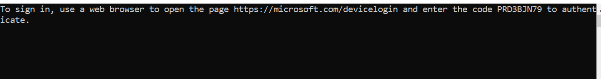
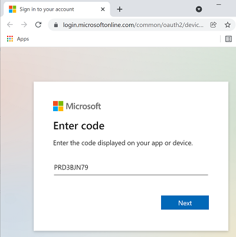
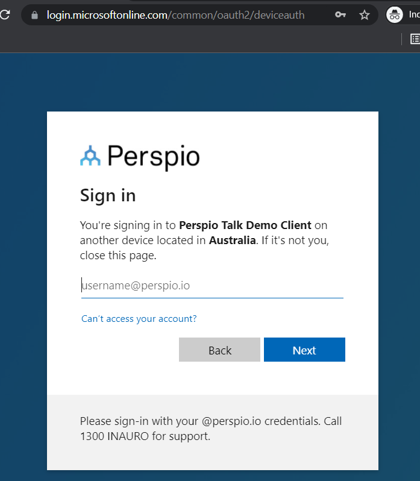
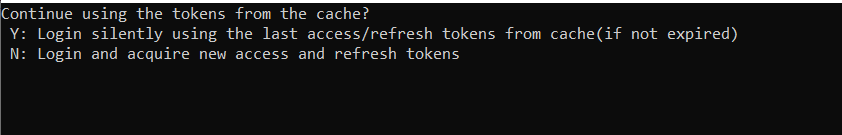

# Perspio Talk Client - Sample Application.

### About this sample

This app is a sample app built in .Net and demonstrates how you can access Perspio Talk APIs
- on behalf of a user : suitable for a web client where your users login to
- using clientId/secret: suitable for daemon agents/background jobs scenario

### Run the  sample application
#### Step 1: Obtain client credentials from Inauro
To test the application you will need the following from Inauro
- clientId: The Application Id for your Perspio Talk Client App registration - Provided by Inauro
- tenant: Azure Tenant hosting the Perspio platform - Provided by Inauro
- subscriptionKey : A unique kep mapped to your Perspio Tenant
- clientSecret: Required to test 'As Daemon' agent flow
- userId/password: Required to test on-behalf-of user flow
- Perspio Talk API end point: By default 
- for dev & testing
  

        private static string _subscriptionKey = "----";
        private static string _clientId = "---";
        private static string _clientSecret = "---";
        private static string _tenant = "----";
        private static string _instance = "https://login.microsoftonline.com/";
        private static string _perspioTalkAPIEndpoint = "https://dev-talk.perspio.io";

Update these values in the program.cs file

        private static string _subscriptionKey = "xxxxxxxx-xxxx-xxxx-xxxx-xxxxxxxxx";
        private static string _clientId = "xxxxxxxx-xxxx-xxxx-xxxx-xxxxxxxxx";
        private static string _clientSecret = "xxxxxxxx-xxxx-xxxx-xxxx-xxxxxxxxx";
        private static string _tenant = "xxxxxxxx-xxxx-xxxx-xxxx-xxxxxxxxx";
        private static string _instance = "https://login.microsoftonline.com/";
        private static string _perspioTalkAPIEndpoint = "https://dev-talk.perspio.io";

You will also need to 
- Your userid and password to login in the following step
  
  
#### Step2: Run the console application and login to windows

In this step the sample application will log you in and cache the access and refresh tokens.

There are two options available (for demo purposes) to choose from. You can login on the same machine using the Interactive Flow option or remotely from another computer using Device Code option.

Option 1: 

Option 2: A device login code that you will need to use on http://microsoft.com/devicelogin

You will then be promoted to login using your perspio service account userid and pwd, provided by Inauro

After successful login to Microsoft the sample client application 
- will cache the acces token to make the Perspio API calls
- will cache the and refresh token so when access token is expired the sample application will automatically refresh the access token. 
 
  
The next time the application is run it will prompt you with the following two options. 

You can choose to force re-login or continue with the cached tokens.

- 
  Note: Refresh tokens are valid for 90 days and automatically get renewed when a new access token is acquired. Therefore no user interaction is required as far as the client application runs at least once in 90 days. If notthen the refresh token will also expire and will require you to relogin following the device/interactive flow as explained above.

#### Step3: Sample Application retrieves your user profile 

After successful login the client application will make a call to the Perpsio User APIs and will retrieve your service account user profile and display that. You can invoke anyother api by replacing the path to the endpoint in program.cs

        static string perspioTalkAPIEndpoint = "https://dev-talk.perspio.io/directory/v3/user"; 

### Develop your own client application

##### LANGUAGES AND FRAMEWORKS

The sample application demonstrates loging in to invoke Perpio APIs using Microsoft Authenticaion Library (MSAL). You can find how MSAL help you in developing for other scenarios and in other languages and Frameworks.

###### Library	Supported platforms and frameworks
- MSAL for Android	Android
- MSAL Angular	Single-page apps with Angular and Angular.js frameworks
- MSAL for iOS and macOS	iOS and macOS
- MSAL Go (Preview)	Windows, macOS, Linux
- MSAL Java	Windows, macOS, Linux
- MSAL.js	JavaScript/TypeScript frameworks such as Vue.js, Ember.js, or Durandal.js
- MSAL.NET	.NET Framework, .NET Core, Xamarin Android, Xamarin iOS, Universal Windows Platform
- MSAL Node	Web apps with Express, desktop apps with Electron, Cross-platform console apps
- MSAL Python	Windows, macOS, Linux
- MSAL React	Single-page apps with React and React-based libraries (Next.js, Gatsby.js)

Check out [MSAL Overview](https://docs.microsoft.com/en-us/azure/active-directory/develop/msal-overview) for further information.

##### Access and Cache Token Storage

The sample application caches the access and refresh tokens in a local cache. However, you can write your own implementation of storing the tokens in another storage such as in a databse etc. 
For more information [check here](https://docs.microsoft.com/en-us/azure/active-directory/develop/msal-net-token-cache-serialization?tabs=aspnetcore)

##### Copyright (c) Inauro.
###### All rights reserved.